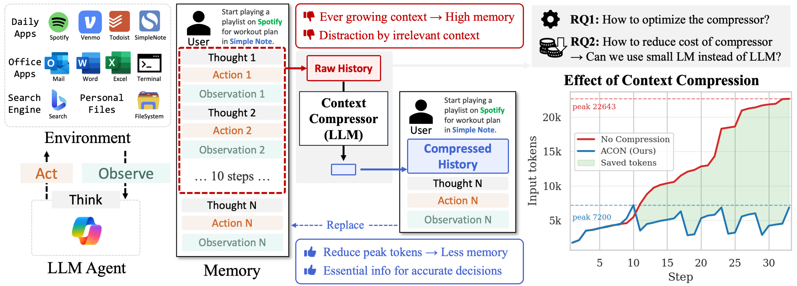

# Agent Context Optimization (ACON): Optimizing Context Compression for Long-horizon LLM Agents

<p align="center">
  
</p>

<p align="center">
  <a href="https://www.python.org/downloads/release/python-3110/">
    
  </a>
  <a href="https://opensource.org/licenses/MIT">
    
  </a>
  <a href="https://arxiv.org/abs/2510.00615">
    
  </a>
  <a href="https://github.com/microsoft/acon/stargazers">
    
  </a>
</p>

`acon` is a research framework for optimizing the context compression for long-horizon LLM agents, focusing on minimizing redundant memory growth while preserving essential information for decision-making.

It provides standardized pipelines for **environments, agents, context compression, and distillation (compressor and agent)** across multiple realistic benchmarks such as **AppWorld**, **OfficeBench**, and **8-objective QA**.

This repository contains the official implementation of the paper:
> [**ACON: Optimizing Context Compression for Long-horizon LLM Agents**](https://arxiv.org/abs/2510.00615)<br>
> _Minki Kang, Wei-Ning Chen, Dongge Han, Huseyin A. Inan, Lukas Wutschitz, Yanzhi Chen, Robert Sim, Saravan Rajmohan_

If you find our work useful, please cite our work:
```bibtex
@misc{kang2025aconoptimizingcontextcompression,
      title={ACON: Optimizing Context Compression for Long-horizon LLM Agents}, 
      author={Minki Kang and Wei-Ning Chen and Dongge Han and Huseyin A. Inan and Lukas Wutschitz and Yanzhi Chen and Robert Sim and Saravan Rajmohan},
      year={2025},
      eprint={2510.00615},
      archivePrefix={arXiv},
      primaryClass={cs.AI},
      url={https://arxiv.org/abs/2510.00615}, 
}
```

## Table of Contents
- [🚀 Quickstart](#-quickstart)
- [🛠️ Installation](#️-installation)
- [📚 Repository Structure](#-repository-structure)
- [📊 Benchmarks](#-benchmarks)
  - [AppWorld](#appworld)
  - [8-Objective QA](#8-objective-qa)
  - [OfficeBench](#officebench)


## 🚀 Quickstart (AppWorld)

Install [AppWorld](https://github.com/StonyBrookNLP/appworld) environment (details in [AppWorld README](experiments/appworld/README.md)).
```bash
git lfs install
git clone https://github.com/StonyBrookNLP/appworld
cd appworld
pip install -e .
appworld install --repo
appworld download data
```

Run AppWorld agent with the history compression:

```bash
git clone https://github.com/microsoft/acon.git
mv /path/to/appworld/data /path/to/acon/experiments/appworld
cd acon
pip install -e .
# Place the openai API key in `configs/private_config.yaml`.

cd experiments/appworld
python run_all.py \
    --split train \
    --model_name gpt-4.1-mini \
    --tag baseline \
    --co_config_path configs/context_opt/gpt-4.1-mini_history.yaml
```

Results will be saved in:

```
experiments/appworld/outputs/gpt-4.1-mini_baseline/
```

Do you want to optimize the compression guideline and distill to a local model? See below!


## 🛠️ Installation

### Prerequisites
- Python 3.11+

### Basic Installation

```bash
git clone https://github.com/microsoft/acon.git
cd acon
pip install -e .
```

### Configuration

Place your OpenAI API key in `configs/private_config.yaml`:

```yaml
openai_key: "your_api_key_here"
```

## 📚 Repository Structure

```text
acon/
├── configs/                # API config
├── experiments/            # benchmark runners (AppWorld, OfficeBench, QA) & utils for fine-tuning and prompt optimization
├── src/productive_agents/  # implementations for environments, agents, and context compressors
└── README.md
```

## 📊 Benchmarks

We currently support three benchmark families:

| Benchmark | Description | Folder |
|------------|--------------|---------|
| **AppWorld** | Day-to-day personal task workflows | [`experiments/appworld`](experiments/appworld) |
| **OfficeBench** | Office productivity automation | [`experiments/officebench`](experiments/officebench) |
| **8-objective QA** | Lightweight reasoning & retrieval tasks | [`experiments/smolagents`](experiments/smolagents) |

All benchmarks follow the same experimental pipeline:
1. Run baseline experiments with GPT models
2. Optimize context compression guidelines
3. Distillation Stage 1 (Compressor LoRA)
4. Distillation Stage 2 (Agent LoRA)

For detailed per-benchmark instructions, please refer to:
- [AppWorld README](experiments/appworld/README.md)
- [8-objective QA README](experiments/smolagents/README.md)
- [OfficeBench README](experiments/officebench/README.md)


## Contributing

This project welcomes contributions and suggestions.  Most contributions require you to agree to a
Contributor License Agreement (CLA) declaring that you have the right to, and actually do, grant us
the rights to use your contribution. For details, visit [Contributor License Agreements](https://cla.opensource.microsoft.com).

When you submit a pull request, a CLA bot will automatically determine whether you need to provide
a CLA and decorate the PR appropriately (e.g., status check, comment). Simply follow the instructions
provided by the bot. You will only need to do this once across all repos using our CLA.

This project has adopted the [Microsoft Open Source Code of Conduct](https://opensource.microsoft.com/codeofconduct/).
For more information see the [Code of Conduct FAQ](https://opensource.microsoft.com/codeofconduct/faq/) or
contact [opencode@microsoft.com](mailto:opencode@microsoft.com) with any additional questions or comments.

## Trademarks

This project may contain trademarks or logos for projects, products, or services. Authorized use of Microsoft
trademarks or logos is subject to and must follow
[Microsoft's Trademark & Brand Guidelines](https://www.microsoft.com/legal/intellectualproperty/trademarks/usage/general).
Use of Microsoft trademarks or logos in modified versions of this project must not cause confusion or imply Microsoft sponsorship.
Any use of third-party trademarks or logos are subject to those third-party's policies.
